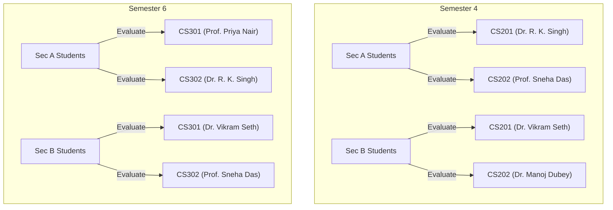

# IIIT Ranchi — Demo Credentials Index

This document provides a comprehensive index of all seeded student and faculty demo accounts for testing the IIIT Ranchi Faculty Feedback System.

> [!IMPORTANT]
> - **Student Default Password**: `IIITR@2026` (forces security reset prompt on first login).
> - **Faculty Default Password**: `faculty123` (already set up and unlocked for instant access).
> - **System Admin Password**: `admin123` (Email: `admin@iiitranchi.ac.in` - unlocked for full administrative control).

---

## 🎓 Student Accounts (15 Seeds)

All students are configured with appropriate Sections (A or B) and Semesters (4 or 6). When they login, they will automatically see the exact dynamic courses mapped to their academic groups.

| Name | Login Email | Roll Number | Sec | Sem | Default Password |
| :--- | :--- | :--- | :---: | :---: | :--- |
| **Aarav Sharma** | `aarav.sharma@iiitranchi.ac.in` | `2026-CS-01` | A | 4 | `IIITR@2026` |
| **Ananya Verma** | `ananya.verma@iiitranchi.ac.in` | `2026-CS-02` | A | 4 | `IIITR@2026` |
| **Kabir Gupta** | `kabir.gupta@iiitranchi.ac.in` | `2026-CS-03` | A | 4 | `IIITR@2026` |
| **Ishaan Roy** | `ishaan.roy@iiitranchi.ac.in` | `2026-CS-04` | B | 4 | `IIITR@2026` |
| **Sanya Iyer** | `sanya.iyer@iiitranchi.ac.in` | `2026-CS-05` | B | 4 | `IIITR@2026` |
| **Diya Sen** | `diya.sen@iiitranchi.ac.in` | `2026-CS-06` | A | 6 | `IIITR@2026` |
| **Rohan Mehta** | `rohan.mehta@iiitranchi.ac.in` | `2026-CS-07` | A | 6 | `IIITR@2026` |
| **Aditi Rao** | `aditi.rao@iiitranchi.ac.in` | `2026-CS-08` | B | 6 | `IIITR@2026` |
| **Aryan Joshi** | `aryan.joshi@iiitranchi.ac.in` | `2026-CS-09` | B | 6 | `IIITR@2026` |
| **Meera Nair** | `meera.nair@iiitranchi.ac.in` | `2026-CS-10` | A | 4 | `IIITR@2026` |
| **Pranav Saxena** | `pranav.saxena@iiitranchi.ac.in` | `2026-CS-11` | B | 4 | `IIITR@2026` |
| **Kirti Mishra** | `kirti.mishra@iiitranchi.ac.in` | `2026-CS-12` | A | 6 | `IIITR@2026` |
| **Devansh Patil** | `devansh.patil@iiitranchi.ac.in` | `2026-CS-13` | B | 6 | `IIITR@2026` |
| **Nisha Reddy** | `nisha.reddy@iiitranchi.ac.in` | `2026-CS-14` | A | 4 | `IIITR@2026` |
| **Yash Kapoor** | `yash.kapoor@iiitranchi.ac.in` | `2026-CS-15` | B | 6 | `IIITR@2026` |

---

## 👨‍🏫 Faculty Accounts (5 Seeds)

Each instructor is assigned to specific key courses and sections, with fully loaded ratings models.

| Name | Login Email | Assigned Term Courses | Password |
| :--- | :--- | :--- | :--- |
| **Dr. R. K. Singh** | `rk.singh@iiitranchi.ac.in` | Object Oriented Programming (`CS201` - A), Computer Networks (`CS302` - A) | `faculty123` |
| **Prof. Sneha Das** | `sneha.das@iiitranchi.ac.in` | Database Management Systems (`CS202` - A), Computer Networks (`CS302` - B) | `faculty123` |
| **Dr. Vikram Seth** | `vikram.seth@iiitranchi.ac.in` | Object Oriented Programming (`CS201` - B), Design and Analysis of Algorithms (`CS301` - B) | `faculty123` |
| **Dr. Manoj Dubey** | `manoj.dubey@iiitranchi.ac.in` | Database Management Systems (`CS202` - B) | `faculty123` |
| **Prof. Priya Nair** | `priya.nair@iiitranchi.ac.in` | Design and Analysis of Algorithms (`CS301` - A) | `faculty123` |

---

## 🏫 Courses & Relational Layout

Students and faculty interact based on the following structured relational map:

---

*Seeding verification successfully completed on May 7, 2026.*
